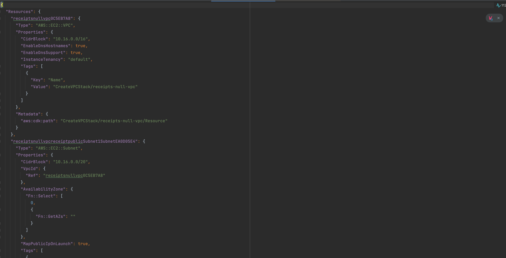

## Deploying AWS Lambda Using AWS Cloud Development Kit (AWS CDK)

AWS CDK is a framework to define the infrastructure in the higher programming language (e.g. java).
Using AWS CDK, 
* You can write the infrastructure in the same language as your service,
* Synthesise it into AWS CloudFormation, then
* Provision physical resource from the resulting CloudFormation stacks.

### This project
This project contains two components
* A lambda handler that accepts a JSON object (a receipt), then save this object as an object in S3
* CDK infrastructure code, that will eventually provision

  1. VPC
  2. 4 subnets (two private and two public), for redundancy
  3. Nat gateway, this is required because the lambda needs access to s#
  4. S3 bucket
  5. Lambda function to save files in S3
  6. Api gateway endpoint to allow clients call lambda as a rest endpoint.
  7. Roles and policies to allow RestApi call lambda and lambda to put objects in S3

#### Directory Structure
```
save-receipt-function
  save-receipts-cdk
    src
      main
        java
          com.coffeebeans.cdk
  save-receipts-lambda
    src
      main
        java
          lambda
```

### Lambda Handler code
Pretty simple logic 
* Accepts input,
* Save in s3, then
* Respond with location of the receipt and 201 status code.

```java
public class SaveReceiptFunction implements RequestHandler<APIGatewayProxyRequestEvent, APIGatewayProxyResponseEvent> {

  private static final AmazonS3 S3_CLIENT = AmazonS3ClientBuilder.defaultClient();
  private static final String BUCKET_NAME = "digital-receipts-dev";

  public APIGatewayProxyResponseEvent handleRequest(final APIGatewayProxyRequestEvent input, final Context context) {
    final LambdaLogger logger = context.getLogger();

    final Map<String, String> headers = createResponseHeaderMap(context);

    final String objectKey = String.format("%s.json", context.getAwsRequestId());
    final String content = input.getBody();

    APIGatewayProxyResponseEvent response = new APIGatewayProxyResponseEvent()
        .withHeaders(headers);
    try {

      S3_CLIENT.putObject(BUCKET_NAME, objectKey, content);

      return response
          .withStatusCode(201);
    } catch (final Exception e) {
      logger.log(e.getLocalizedMessage());
      return response
          .withStatusCode(500);
    }
  }

  private Map<String, String> createResponseHeaderMap(Context context) {
    final Map<String, String> headers = new HashMap<>();
    headers.put("Content-Type", "application/json");
    headers.put("Location", String.format("/receipt/%s", context.getAwsRequestId()));
    return headers;
  }
}
```

### CDK code
VPC stack that defines,
* Non-default VPC with
  * CIDR block `10.16.0.0/16`
  * number of nat gateways required
  * Subnet configurations
* Lambda function with `java11` and size `512` inside the above VPC
* S3 bucket with `S3_MANAGED` encryption
* API gateway endpoint
* IAM roles to grant access between
  * Lambda and S3
  * Api gateway and lambda

The code is broken into manin VPCStack class and other fine-grained creator classes focus on creating certain resources. For instance
* LambdaFunctionCreator
* LambdaRestApiCreator
* S3BucketCreator
* SubnetCreator

Note: while granting access from lambda to S3 is explicit
```java
bucket.grantPut(Objects.requireNonNull(saveReceiptsHandler.getRole()));
```
The access between api gateway and lambda is more subtle and activated in the second line of the following snippet from the `LambdaRestApiCreator` class
```java
final LambdaRestApi lambdaRestApi = Builder.create(scope, endpoint)
        .handler(function)
        .proxy(proxy)
        .restApiName(endpoint)
        .deployOptions(StageOptions.builder().stageName(stageName).build())
        .build();
```

```java
public class VpcStack extends Stack {

  private static final String CIDR = "10.16.0.0/16";
  private static final int CIDR_MASK = 20;

  public VpcStack(final Construct parent, final String id) {
    this(parent, id, null);
  }

  public VpcStack(final Construct parent, final String id, final StackProps props) {
    super(parent, id, props);
    final String env = System.getenv("ENV");
    final String vpcId = String.format("receipts-%s-vpc", env);

    final Vpc vpc = Vpc.Builder.create(this, vpcId)
        .cidr(CIDR)
        .subnetConfiguration(createSubnetConfigurations())
        .natGateways(1)
        .natGatewayProvider(NatProvider.gateway())
        .build();

    Tags.of(vpc).add("env", env);

    final Function saveReceiptsHandler = createLambdaFunction(vpc, env);

    final Bucket bucket = createBucket(this, String.format("digital-receipts-%s", env), BLOCK_ALL, S3_MANAGED, false, false);

    bucket.grantPut(Objects.requireNonNull(saveReceiptsHandler.getRole()));

    createLambdaRestApi(this, saveReceiptsHandler, "ReceiptsEndpoint", "dev", false, "receipt", Lists.newArrayList("POST"));
  }

  private Function createLambdaFunction(final Vpc vpc, final String env) {
    final String saveReceiptsHandler = "SaveReceiptsHandler";
    final String handler = "com.coffeebeans.lambda.SaveReceiptFunction";
    final AssetCode assetCode = fromAsset("../save-receipts-lambda/target/save-receipts-lambda-0.1.jar");
    final Function saveReceiptsFunction = createFunction(this, saveReceiptsHandler, handler, JAVA_11, assetCode, vpc);

    Tags.of(saveReceiptsFunction).add("env", env);
    return saveReceiptsFunction;
  }

  private List<? extends SubnetConfiguration> createSubnetConfigurations() {
    final SubnetConfiguration zoneAReceiptPublicSubnet = new SubnetConfiguration.Builder()
        .cidrMask(CIDR_MASK)
        .subnetType(SubnetType.PUBLIC)
        .name("receipt-public")
        .build();

    final SubnetConfiguration zoneBReceiptPublicSubnet = new SubnetConfiguration.Builder()
        .cidrMask(CIDR_MASK)
        .subnetType(SubnetType.PRIVATE)
        .name("receipt-private")
        .build();

    return newArrayList(zoneAReceiptPublicSubnet, zoneBReceiptPublicSubnet);
  }
}
```

Finally, an Application class that works as entry point
```java
public final class Application {

  public static void main(final String... args) {
    final App app = new App();
    final VpcStack vpcStack = new VpcStack(app, "CreateVPCStack");
    Tags.of(vpcStack).add("env", "dev");
    app.synth();
  }
}
```

### Deployment
```shell
cd /path/to/save-receipt-function
mvn clean package  
cd save-receipts-cdk
cdk bootstrap --profile receipts-dev
```


```shell
cdk deploy --profile receipts-dev
```



